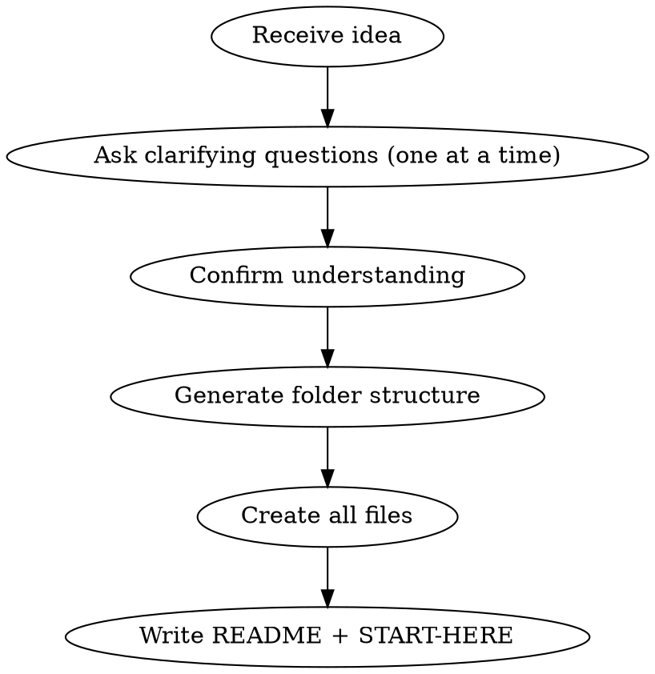

# Project Context Generator

## Overview

Transforms a raw project idea into a fully structured AI development context repository — a `docs/` folder containing product vision, domain knowledge, architecture, module specs, user stories, and development guides. Modeled on the DFMS product context structure used by Brain Station 23.

**Scalability is a first-class concern.** Every layer of generated documentation — NFRs, architecture decisions, module specs, data models, deployment guides — must encode scalability thinking explicitly. Do NOT treat scalability as an afterthought section; weave it throughout.

## When to Use

- User shares any project idea, concept, or product description
- User says "generate context", "create docs", "break down my idea"
- User shares a PRD, SOW, or feature list that needs structuring
- User wants AI-ready context for a development team

## Process



### Step 1 — Gather Project Info (One Question at a Time)

Ask these questions sequentially, waiting for each answer:

1. **What does the product do?** (core problem it solves, who uses it)
2. **What type of product?** (web app, mobile, API, SaaS platform, internal tool)
3. **What tech stack?** (or "not decided yet" — use generic best practices)
4. **Who are the main user roles?** (e.g., Admin, Manager, Driver, Customer)
5. **What are the 3-5 core modules or feature areas?** (e.g., "User Management, Orders, Reporting")
6. **What is the expected scale?** — This is required, not optional. Ask:
   - How many concurrent users at peak? (tens, hundreds, thousands, millions?)
   - Is this multi-tenant (one system serving many organizations)?
   - Any geographic distribution (single region, multi-region, global CDN)?
   - Estimated daily transaction volume?
   - Data retention requirements (how long, how much)?
7. **What phase is this?** (idea/discovery, MVP planning, active development)
8. **Any source documents to reference?** (PRD, SOW, feature list — user can paste content)

If the user already provided enough info in their initial message, skip questions that are already answered. **Never skip question 6** — scale assumptions shape every architectural decision.

### Step 2 — Generate Folder Structure

Create the following in `docs/` (relative to current working directory):

```
docs/
├── README.md
├── 00-START-HERE.md
├── 01-PRODUCT_VISION.md
├── 02-REPOSITORY_PURPOSE.md
├── 02-domain/
│   ├── README.md
│   └── 01-overview/
│       ├── product-vision.md
│       ├── glossary.md
│       ├── stakeholders.md
│       ├── value-proposition.md
│       └── current-challenges.md
│   └── 02-requirements/
│       ├── 01-business-objectives/
│       │   └── business-objectives.md
│       ├── 02-user-personas/
│       │   └── user-personas.md
│       ├── 03-functional-requirements/
│       │   └── functional-requirements.md
│       └── 04-non-functional-requirements/
│           └── non-functional-requirements.md
│   └── 03-business-rules/
│       └── core-business-rules.md
│   └── 04-business-processes/
│       └── core-workflows.md
├── 03-backlog/
│   ├── README.md
│   ├── sprints/
│   │   └── sprint-1-plan.md
│   └── stories/
│       └── (US-001 through US-0XX — one per core user story)
├── 04-architecture/
│   ├── README.md
│   └── 00-overview/
│       ├── architecture-summary.md
│       ├── design-principles.md
│       └── technology-stack-overview.md
│   └── 01-system-design/
│       └── system-context.md
│   └── 02-scalability/
│       ├── scalability-strategy.md       ← REQUIRED for every project
│       ├── caching-strategy.md
│       └── database-scaling.md
│   └── 03-decisions/
│       ├── ADR-001-initial-architecture.md
│       └── ADR-002-scalability-approach.md  ← REQUIRED for every project
├── 05-modules/
│   ├── README.md
│   └── (one subfolder per module, each with a spec .md)
├── 06-contracts/
│   ├── README.md
│   └── 01-apis/
│       └── rest/
│           └── (one yaml per module)
│   └── 02-data-models/
│       └── core-entities.md
├── 07-design-system/
│   ├── README.md
│   └── 01-foundation/
│       └── design-tokens.md
│   └── 02-components/
│       └── component-library.md
├── 08-development-guides/
│   ├── README.md
│   └── 01-setup/
│       └── dev-environment-setup.md
│   └── 02-conventions/
│       └── coding-standards.md
│   └── 03-security/                       ← NEW — REQUIRED
│       ├── authentication-guide.md
│       ├── authorization-rbac-guide.md
│       ├── data-encryption.md
│       └── security-checklist.md
│   └── 04-deployment/                     ← NEW — REQUIRED
│       ├── environments.md
│       ├── ci-cd-pipeline.md
│       ├── infrastructure-overview.md
│       └── rollback-runbook.md
│   └── 05-observability/                  ← NEW — REQUIRED
│       ├── logging-strategy.md
│       ├── metrics-and-alerting.md
│       └── error-handling-standard.md
├── 09-testing/
│   ├── README.md
│   └── strategy/
│       └── testing-strategy.md
└── 10-workflows/                          ← NEW — REQUIRED
    ├── README.md
    ├── operational-flows/
    │   └── (one .md per core end-to-end business process)
    ├── user-workflows/
    │   └── (one .md per user role)
    └── exception-scenarios/
        └── exception-handling-flows.md
```

### Step 3 — File Format Standards

Every `.md` file MUST start with YAML frontmatter:

```yaml
---
title: <Human readable title>
category: <overview|requirements|architecture|module|story|guide|testing>
phase: <discovery|planning|development|production>
status: <draft|approved|in-progress|complete>
created: <YYYY-MM-DD>
updated: <YYYY-MM-DD>
tags: [<relevant>, <tags>]
---
```

User stories additionally include:

```yaml
---
title: <Story title>
story_id: US-001
phase: phase-1
module: <Module Name>
priority: <Critical|High|Medium|Low>
status: Pending
epic: <Epic Name>
story_points: <estimate>
created: <YYYY-MM-DD>
related_stories: []
dependencies: []
tags: []
---
```

User story body template:

```markdown
# US-XXX: <Title>

## User Story
**As a** <role>
**I want to** <action>
**So that** <benefit>

## Business Context
<Why this matters, 2-3 sentences>

## Acceptance Criteria
### AC-1: <Scenario>
- [ ] System SHALL <requirement>

## Functional Requirements
### FR-001: <Requirement Name>
- [<Priority>] <Description>

## Business Rules
- BR-001: <Rule>

## Dependencies
- <Other stories or systems>
```

Module spec template:

```markdown
---
module: <module-folder>
specification: <Module Name> Specification
version: 1.0
phase: Phase 1
last_updated: <YYYY-MM-DD>
related_stories: [US-001, US-002]
---

# <Module Name>

## Overview
<What this module does, 2-3 sentences>

## Core Capabilities
| Capability | Description |
|-----------|-------------|
| <feature> | <description> |

## Data Models
### <Entity Name>
| Field | Type | Description | Index |
|-------|------|-------------|-------|
| id | UUID | Primary key | PK |
| tenant_id | UUID | Multi-tenancy partition key | INDEX (required if multi-tenant) |
| created_at | TIMESTAMP | Creation time | INDEX for time-range queries |

**Indexing Strategy**: List the high-traffic query patterns and which indexes support them.
**Partitioning**: Note if this table needs partitioning (by tenant_id, date, region) and why.
**Data Volume Estimate**: Rows/day at target scale; when will it need archiving or partitioning?

## Workflows
### <Workflow Name>
<Step 1> → <Step 2> → <Step 3>

**Async vs Sync**: Mark which steps can be async (queued) vs must be synchronous.

## Scalability Considerations
- **Read/Write ratio**: (e.g., 80% reads, 20% writes — favors read replicas + caching)
- **Caching**: What can be cached, TTL, invalidation strategy (e.g., menu items: Redis, 5min TTL)
- **Bottlenecks**: Identify the most likely bottleneck at 10x current load
- **Async offloading**: Which operations should be queued (email, notifications, heavy reports)
- **Rate limiting**: Any endpoints that need rate limiting to prevent abuse/overload

## Integration Points
- <What other modules this connects to>

## Business Rules
- BR-001: <Rule>
```

Security architecture template (`08-development-guides/03-security/`):

```markdown
---
title: Security Architecture — <Project Name>
category: security
phase: <phase>
status: draft
created: <YYYY-MM-DD>
owasp_top10: [A01-BrokenAccessControl, A02-CryptographicFailures, A07-AuthFailures]
tags: [security, auth, rbac, encryption]
---

# Security Architecture

## Auth Strategy
- **Protocol**: JWT (short-lived access token, 15min) + refresh token (7 days, rotated on use)
- **Token source**: Authorization header only — never URL params or cookies without HttpOnly+SameSite
- **Issuer validation**: verify `iss`, `aud`, `exp` on every request
- **Multi-tenant**: tenant_id in JWT claims, validated server-side against active tenant list (never trust client-supplied tenant header)

## RBAC Model (deny by default)
| Role | Resources | Permissions |
|------|-----------|-------------|
| Admin | All | READ, WRITE, DELETE |
| <Role> | <Resources> | <Permissions> |

**Principle**: RBAC for coarse access + ABAC for row-level (e.g., users may only write their own records).
All access decisions MUST be logged: user_id, resource, action, granted (true/false), reason.

## OWASP Top 10 Controls
- **A01 Broken Access Control**: All routes require auth middleware; deny by default; no client-supplied role escalation
- **A02 Cryptographic Failures**: TLS 1.2+ in transit; AES-256 at rest for PII; bcrypt (cost≥12) for passwords
- **A03 Injection**: Parameterized queries only; ORM-only DB access; no string interpolation in queries
- **A05 Misconfiguration**: Secrets in env vars/vault only; no credentials in code or logs
- **A07 Auth Failures**: Account lockout after 5 failed attempts; MFA for admin roles; session expiry enforced
- **A09 Logging Failures**: All auth events, access denials, and data mutations logged (see logging-strategy.md)

## PII Handling
- Fields classified as PII: <list fields — e.g., email, phone, NID, address>
- PII encrypted at rest, never logged in plaintext
- Right-to-erasure: soft-delete + async PII scrub job

## Security Checklist (pre-deploy)
- [ ] All endpoints require authentication (no accidental public routes)
- [ ] Rate limiting on auth endpoints (max 10 req/min per IP)
- [ ] CORS restricted to known origins
- [ ] Security headers: CSP, X-Content-Type-Options, X-Frame-Options, HSTS
- [ ] Dependency vulnerability scan (npm audit / pip check) in CI
- [ ] No secrets in git history
```

Operational workflow template (`10-workflows/operational-flows/`):

```markdown
---
title: <Flow Name> — Operational Flow
category: workflow
type: operational  # operational | user-workflow | exception
roles_involved: [<Role1>, <Role2>]
modules_touched: [<Module1>, <Module2>]
created: <YYYY-MM-DD>
tags: [workflow, <domain-term>]
---

# <Flow Name> — End-to-End Flow

## Overview
<2-sentence description of what this flow achieves and why it matters>

## Trigger
<What initiates this flow — user action, scheduled job, external event>

## Flow Diagram
```
<Actor/Role>          <System>               <Module>
     |                    |                      |
     |--- <Action> ------>|                      |
     |                    |--- <Internal Op> --->|
     |                    |<-- <Result> ---------|
     |<-- <Response> -----|                      |
     |                    |                      |
```

## Steps
| Step | Actor | Action | System Response | Notes |
|------|-------|--------|----------------|-------|
| 1 | <Role> | <Action> | <Response> | <Business rule, validation> |

## Business Rules in This Flow
- BR-XXX: <Rule that governs a step>

## Exception Paths
| Exception | Trigger | Handling |
|-----------|---------|---------|
| <Exception> | <When it occurs> | <How system handles it> |

## Success Criteria
- <Observable outcome that confirms this flow completed correctly>
```

Error handling standard template (`08-development-guides/05-observability/error-handling-standard.md`):

```markdown
---
title: Error Handling Standard
category: guide
tags: [errors, logging, observability, RFC7807]
---

# Error Handling Standard

## HTTP Error Response Shape (RFC 7807 Problem Details)
All API errors MUST return this JSON shape — no exceptions:

```json
{
  "type": "https://<domain>/errors/<error-code>",
  "title": "Human-readable error name",
  "status": 422,
  "detail": "User-safe explanation — NO internal details",
  "instance": "/api/v1/<resource>/<id>",
  "reference_id": "err_a3f9b2c1"
}
```

**Never include**: stack traces, SQL errors, internal paths, service names, or any implementation detail in the response body.
**Always include**: a `reference_id` so support can correlate user report → server log.

## HTTP Status Code Map
| Scenario | Status | Notes |
|----------|--------|-------|
| Validation failure | 422 | Field-level errors in `errors[]` array |
| Auth missing/invalid | 401 | Generic — don't reveal why |
| Forbidden (wrong role) | 403 | Don't reveal what resource exists |
| Not found | 404 | Same response for missing vs unauthorized (prevents enumeration) |
| Rate limited | 429 | Include `Retry-After` header |
| Upstream dependency down | 503 | With `Retry-After` |
| Everything else | 500 | Generic — log full detail internally |

## Logging Standard (structured JSON)
Every log line MUST be structured JSON:

```json
{
  "datetime": "ISO8601+UTC",
  "level": "INFO|WARN|ERROR",
  "event": "AUTHN_login_success | AUTHZ_denied | DATA_mutation | SYS_error",
  "reference_id": "err_a3f9b2c1",
  "user_id": "<UUID or null>",
  "tenant_id": "<UUID or null>",
  "source_ip": "<IP>",
  "request_method": "POST",
  "request_uri": "/api/v1/orders",
  "duration_ms": 45,
  "message": "Human-readable summary"
}
```

**Never log**: passwords, tokens, PII in plaintext, full stack traces (log `traceback_hash` instead).

## Mandatory Log Events
| Event | Level | When |
|-------|-------|------|
| AUTHN_login_success | INFO | Every successful login |
| AUTHN_login_failed | WARN | Every failed login attempt |
| AUTHZ_denied | WARN | Every access control rejection |
| DATA_created / DATA_updated / DATA_deleted | INFO | All mutations on sensitive entities |
| RATE_LIMIT_hit | WARN | Rate limit triggered |
| SYS_error | ERROR | Unhandled exception (with reference_id) |

## Retry & Resilience Policy
- **Idempotency**: All POST/PUT endpoints accept an `Idempotency-Key` header; duplicate requests return cached result
- **Timeout**: All outbound calls (DB, external APIs) capped at 5s; fail fast, don't cascade
- **Retry**: 3 attempts with exponential backoff (1s, 2s, 4s) for transient errors (503, network timeout)
- **Circuit breaker**: Open after 5 consecutive failures to same upstream; half-open probe after 30s
```

Deployment architecture template (`08-development-guides/04-deployment/`):

```markdown
---
title: Deployment Architecture
category: guide
tags: [deployment, ci-cd, environments, infrastructure]
---

# Deployment Architecture

## Environments
| Environment | Purpose | Data | Access |
|-------------|---------|------|--------|
| local | Developer machine | Seeded fixtures | Developer only |
| dev | Integration testing | Anonymized copy | Dev team |
| staging | Pre-release validation | Production-like | QA + stakeholders |
| production | Live system | Real data | On-call + automated |

**Promotion path**: local → dev (on PR merge) → staging (on release tag) → production (manual approval gate)

## CI/CD Pipeline
```
Push to branch
  └── Lint + type-check (< 2 min)
  └── Unit tests (< 5 min)
  └── Build Docker image
  └── Vulnerability scan (npm audit / trivy)
  └── Push to dev (auto, on merge to main)
       └── Integration tests against dev
       └── Tag release → deploy to staging (auto)
            └── Smoke tests on staging
            └── Manual approval gate
            └── Deploy to production (blue/green)
                 └── Health check (30s)
                 └── Rollback auto-trigger if health check fails
```

## Infrastructure Overview (per environment)
| Component | Dev | Staging | Production |
|-----------|-----|---------|------------|
| App servers | 1 instance | 2 instances | Auto-scale 2–10 |
| Database | Single primary | Primary + 1 replica | Primary + 2 replicas |
| Cache (Redis) | Single node | Single node | Redis cluster |
| Queue | In-process or dev queue | Managed queue | Managed queue (SQS/RabbitMQ) |
| CDN | None | None | CDN for static assets |

## Secrets Management
- All secrets in environment variables (never in code or config files)
- Secret rotation: every 90 days for service accounts, every 30 days for API keys
- Vault/SSM Parameter Store for production secrets; `.env.local` for local dev (gitignored)

## Rollback Runbook
1. Detect: automated health check fails OR error rate > 1% over 5 min (alert fires)
2. Decide: on-call engineer approves rollback within 10 min SLA
3. Execute: re-deploy previous Docker image tag (zero-downtime blue/green swap)
4. Verify: run smoke test suite; confirm error rate drops
5. Post-mortem: filed within 24h for any production rollback
```

### Step 4 — Content Generation Rules

- **Product Vision** (`01-PRODUCT_VISION.md`): Cover the "why", target users, phased rollout plan. **Include a Scalability Vision section**: multi-tenancy approach, geographic expansion plan, design-for-scale principles (stateless services, horizontal scaling, eventual consistency where acceptable).

- **Non-Functional Requirements** (`02-domain/02-requirements/04-non-functional-requirements/`): This is not a checkbox. Generate concrete, measurable targets based on the scale answers:
  - **Performance**: p50/p95/p99 API latency targets; page load targets
  - **Throughput**: peak requests/sec, peak concurrent users, peak transactions/day
  - **Availability**: uptime SLA (99.9% = 8.7h/yr downtime; 99.99% = 52min/yr)
  - **Scalability**: how the system must behave at 2x, 10x, 100x current load
  - **Data**: storage growth rate, retention policy, archiving strategy
  - **Multi-tenancy**: tenant isolation model (shared DB vs schema-per-tenant vs DB-per-tenant)

- **Architecture Summary** (`04-architecture/00-overview/architecture-summary.md`): Include ASCII C4 diagram, tech stack table. **Mandatory sections**:
  - Horizontal vs vertical scaling strategy
  - Stateless service design (why each service can scale out)
  - Data tier scaling (read replicas, connection pooling, caching layer)
  - Async processing layer (queue/worker pattern for heavy ops)
  - CDN/edge strategy (if applicable)

- **Scalability Strategy** (`04-architecture/02-scalability/scalability-strategy.md`): **Required file**. Cover:
  - Current scale targets (from Step 1 question 6)
  - Growth tiers: how architecture evolves at Phase 1 → Phase 2 → Phase 3 scale
  - Bottleneck map: for each module, what breaks first at 10x load
  - Infrastructure scaling playbook: what to scale first (app servers, DB, cache)
  - Multi-tenancy isolation model and tenant-aware query patterns

- **Caching Strategy** (`04-architecture/02-scalability/caching-strategy.md`): Per-module cache plan. For each cacheable resource: what is cached, cache key pattern, TTL, invalidation trigger, cache layer (Redis/CDN/in-memory).

- **Database Scaling** (`04-architecture/02-scalability/database-scaling.md`): Index strategy per table, read replica routing, connection pool sizing, slow-query thresholds, partitioning/sharding plan at scale.

- **ADR-001** (`04-architecture/03-decisions/ADR-001-initial-architecture.md`): Monolith vs microservices vs modular monolith. **Every ADR must include a Scalability Impact section**: how this decision affects horizontal scaling, operational complexity at scale, and migration path if scale demands change.

- **ADR-002** (`04-architecture/03-decisions/ADR-002-scalability-approach.md`): **Required**. Documents: chosen multi-tenancy model (and why), DB scaling approach (single primary + replicas vs sharding), async processing tool (queue choice), caching tier (Redis vs Memcached vs CDN), chosen trade-offs (consistency vs availability).

- **Domain Overview** (`02-domain/01-overview/`): Product vision, value proposition, glossary, stakeholders, current pain points.

- **User Personas** (`02-domain/02-requirements/02-user-personas/`): One section per role — responsibilities, goals, pain points, key system actions.

- **Functional Requirements**: Organized by module; use priority levels [Critical|High|Medium|Low].

- **User Stories**: 5-15 stories for critical paths. US-001, US-002 numbering. **Each story's Acceptance Criteria must include at least one performance/scale AC** (e.g., "System SHALL respond within 300ms under 500 concurrent users").

- **Module Specs**: One per core module. Use the module spec template above — the Scalability Considerations section is mandatory, not optional.

- **Testing Strategy** (`09-testing/strategy/`): Unit, integration, E2E. **Add a Load & Performance Testing section**: target RPS for load tests, tools (k6/Locust/Artillery), what passes/fails a load test, baseline benchmarks.

- **Security Architecture** (`08-development-guides/03-security/`) — **Required, always generated.** Use the security template above. Key OWASP-grounded rules:
  - JWT access tokens short-lived (15min); refresh tokens rotated on use
  - Tenant context extracted from verified JWT claims only — never from a client-supplied header
  - RBAC deny-by-default; all access decisions logged (user_id, resource, action, granted, reason)
  - ABAC on top of RBAC for row-level ownership (users can only write their own records)
  - OWASP Top 10 2021 controls mapped explicitly to the project's architecture
  - PII fields named and encrypted at rest; never logged in plaintext; right-to-erasure handled
  - Security checklist section (CORS, rate limiting on auth, security headers, dependency scan in CI)

- **Error Handling Standard** (`08-development-guides/05-observability/error-handling-standard.md`) — **Required, always generated.** Use the error handling template above. Key rules from OWASP:
  - All errors follow RFC 7807 Problem Details shape: `type`, `title`, `status`, `detail`, `reference_id`
  - Never expose stack traces, SQL errors, internal paths, or service names in responses
  - Always include a `reference_id` to correlate user reports to server logs
  - 404 and 403 return identical responses for missing vs unauthorized (prevents enumeration attacks)
  - Structured JSON logs for every auth event, access denial, data mutation, and unhandled exception
  - Log traceback hash (SHA256 truncated), not full stack trace — prevents secrets/paths leaking into logs
  - Retry policy: 3 attempts, exponential backoff; circuit breaker after 5 consecutive failures
  - All POST/PUT endpoints must support `Idempotency-Key` header

- **Deployment Architecture** (`08-development-guides/04-deployment/`) — **Required, always generated.** Use the deployment template above:
  - Four environments: local → dev → staging → production with explicit promotion path
  - CI/CD pipeline steps in order: lint → tests → build → vulnerability scan → deploy → health check → rollback trigger
  - Infrastructure table per environment (app servers, DB replicas, cache, queue)
  - Secrets in env vars / vault only — never in code; rotation schedule documented
  - Rollback runbook: detect → decide → execute → verify → post-mortem

- **Operational Workflows** (`10-workflows/`) — **Required, always generated.** Use the workflow template above:
  - One file per major end-to-end business process (e.g., "order lifecycle", "user onboarding", "payment flow")
  - One file per user role (e.g., "waiter workflow", "admin workflow") — what can they do, in what sequence
  - One exception-scenarios file covering what happens when each step fails (upstream down, validation error, timeout)
  - Workflows must cross module boundaries — they show what module specs cannot: the full chain

### Step 5 — README and START-HERE

`README.md` — Full repository overview with:
- What this project is
- Complete folder structure tree (like the DFMS one)
- Status table (which sections are complete)
- Quick links by role (Developer, PM, QA, Architect)

`00-START-HERE.md` — Navigation guide with:
- Reading order for first-time users
- Quick links by role
- Common tasks (understand a feature, implement a module, trace requirements)

### Step 6 — After Generation

Tell the user:
- Total files created and folder structure
- Suggest next steps: "You can now use this context folder as a git submodule in your implementation repos"
- Offer to dive deeper into any section (generate more user stories, expand a module spec, write API contracts)

## Key Principles

- **Scalability is structural, not cosmetic**: Don't add a "scalability" section at the end — encode scale decisions into data models (indexes, tenant_id), architecture (stateless, async queues), NFRs (concrete numbers), and every module spec
- **Scale from the answer to question 6**: A 50-user internal tool and a 1M-user SaaS have completely different scaling docs — use the user's actual numbers
- **Adapt depth to phase**: Discovery-phase gets lighter docs; development-phase gets full specs — but the scalability strategy is always present
- **Use the user's language**: Mirror their domain terms in every file — don't generalize away specifics
- **Numbered folders**: Always use `01-`, `02-` prefixes on folders to control sort order
- **Cross-reference freely**: Stories reference modules; modules reference architecture; guides reference contracts
- **ASCII diagrams**: Use box/arrow ASCII art for architecture and workflow diagrams (no external tools needed)
- **Always generate `docs/` as the root**: Never put context files at project root — always under `docs/`
- **Multi-tenancy default**: Unless the user says single-tenant, design for multi-tenancy from day one (tenant_id on every entity, tenant-scoped queries, tenant isolation model documented)

## Scalability Patterns to Apply by Default

These patterns should appear in generated docs unless the user's scale explicitly doesn't need them:

| Pattern | Where to Document | When to Apply |
|---------|------------------|--------------|
| Stateless API services | Architecture summary | Always — enables horizontal scaling |
| Read replicas | DB scaling doc, module specs | When reads >> writes or > 1000 RPD |
| Redis caching layer | Caching strategy, module specs | When same data is read repeatedly |
| Async job queue | Architecture summary, module specs | For emails, notifications, reports, heavy compute |
| Connection pooling | DB scaling doc, dev guide | Always — prevent DB connection exhaustion |
| Tenant_id on all entities | Data models in module specs | If multi-tenant |
| Soft deletes | Data models | Always — enables audit and recovery |
| Pagination on all list endpoints | API contracts, user stories | Always — never return unbounded lists |
| Rate limiting | NFRs, API contracts | On all public-facing endpoints |
| Index on foreign keys + query filters | Data models | Always — document expected query patterns |

## Common Mistakes

- Generating generic placeholder content instead of project-specific text — use the user's actual domain and scale numbers
- Skipping YAML frontmatter on any file
- Creating modules that don't match what the user described — confirm module list before generating
- Making user stories too vague — each story needs concrete "System SHALL" acceptance criteria
- **Writing scalability as a vague aspiration** ("the system should be scalable") instead of concrete decisions ("3 app server replicas behind ALB, Redis cluster for session + caching, PostgreSQL with 1 primary + 2 read replicas, SQS for async jobs")
- **Skipping tenant_id in data models** for multi-tenant projects — this causes expensive refactors later
- **No async queue for heavy operations** — report generation, email sending, and data exports must never block the request thread
- **Exposing internal details in error responses** — stack traces, SQL errors, service names must never reach the client; use reference_id + generic message
- **Skipping the security checklist** — CORS, rate limiting on auth, HSTS, and dependency scanning must be documented before any code is written
- **No rollback plan** — every deployment doc must include: how to detect a bad deploy, how to roll back, and how fast (RTO target)
- **Module specs without workflow docs** — cross-module flows (the happy path AND exception paths) cannot be inferred from module specs alone; `10-workflows/` is mandatory
- Forgetting the README and 00-START-HERE files — these are the entry points

## Quick Reference

| Output File Type | Naming | Required? | Key Content |
|-----------------|--------|-----------|-------------|
| Product vision | `01-PRODUCT_VISION.md` | Always | Phases, scalability vision, design principles |
| NFRs | `non-functional-requirements.md` | Always | p99 latency, RPS, uptime SLA — concrete numbers |
| Architecture summary | `architecture-summary.md` | Always | C4 diagram, stateless design, async layer |
| Scalability strategy | `scalability-strategy.md` | Always | Growth tiers, bottleneck map, infra playbook |
| Caching + DB scaling | `caching-strategy.md`, `database-scaling.md` | Always | Per-resource cache plan, indexes, replicas |
| ADR | `ADR-00X-title.md` | Always (2+) | Context, decision, consequences, scalability impact |
| **Security architecture** | `authentication-guide.md`, `security-checklist.md` | **Always** | JWT, RBAC/ABAC, OWASP Top 10, PII fields |
| **Error handling standard** | `error-handling-standard.md` | **Always** | RFC 7807 shape, log format, retry policy |
| **Deployment architecture** | `environments.md`, `ci-cd-pipeline.md` | **Always** | 4 environments, CI/CD steps, rollback runbook |
| **Operational workflows** | `10-workflows/operational-flows/*.md` | **Always** | End-to-end flows, role workflows, exception paths |
| Module spec | `module-name.md` | Per module | Data model + indexes, workflows, scalability notes |
| User story | `US-001-short-title.md` | 5–15 | "System SHALL" ACs, 1+ performance AC |
| API contract | `resource-name.yaml` | Per module | OpenAPI 3.0, pagination, rate-limit headers |
